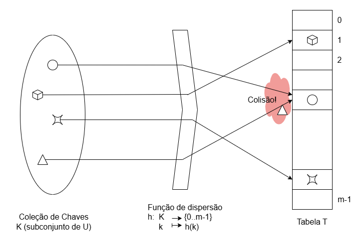

# Tabelas de Dispersão

**Problema:**
Manter coleção dinâmica de registros com busca (exata e unitária) **muito** eficiente.

**Supomos que** cada registro possui chave numérica num conjunto

$$
U = \{ 0, \dots, u - 1 \}
$$

Registro: 

```
+-----+------+
| key | data |
+-----+------+
```

## Ideia 0:

* Usar array de booleanos $T = (t[0], \dots, t[u-1])$
* Registro com chave $k$ na posição $T[k]$
* Inserir/Remover/Consultar requer apenas acesso à posição $T[k]$ → Instantâneo com arrays

**Problema:** $u \gg n$ (nº de registros) $\Rightarrow$ ineficiência de memória

This page is also very clear — here's a full transcription:


## Ideia 1: Hash table




* $K=\{k_0,\ldots,k_{n-1}\} \subset U$: conjunto de chaves 
* $h: K \rightarrow \{0..m-1\}$: função de dispersão que mapeia cada chave numa posição da tabela
* $T$: tabela com $m \propto n$ posições

⚠️ Uma **colisão** ocorre quando duas chaves são mapeada na mesma posição da tabela


### Tarefas:

- I. Definir função de dispersão
- II. Tratar colisões


## Funções de Dispersão

### Requisitos:

1. **Dispersar uniformemente** as chaves pela tabela
2. **Ser robusta** a regularidades e viéses nas chaves

### Desafios:

1. Distribuição das chaves desconhecida
2. Regularidades frequentes

⚠️ **Não existe receita única** ⇒ **heurísticas**


### Exemplo 1 — Heurística da divisão

$$
h(k) = k \bmod m
$$

* Eficiência depende de $m$
* Sensível a regularidades
* Por exemplo, se $m = 2^r$, então:

$$
k = 101010011110110
$$

$$
h(k) = \text{r bits menos significativos (lsb's)}
$$

* Regularidades nos bits menos significativos (**lsb's**) são **muito comuns** → isso leva a **colisões**.

* ✅ Estratégia:
	- Escolher $m$ como um **número primo**, **não próximo** de potências de 2 ou 10 (bases comuns em dados reais).


### Exemplo 2 – Heurística da Multiplicação

$$
h(k) = ((A \cdot k) \mod 2^w) \ \text{rsh} \ (w - r)
$$

📌 Onde:

* $A$ é um **inteiro ímpar** tal que $2^{w-1} < A < 2^w$ (primeiro e último bits = 1)
* `rsh` = **right-shift binário** (deslocamento à direita)
* $m = 2^r$ é o número de posições da tabela
* $w$ é o número de bits de um inteiro

#### Exemplo:

* $m = 8 = 2^3 \Rightarrow r = 3$
* $w = 7$
* $A = 1010001$
* $k = 1101011$

```
       1011001 : A
       1101011 : k
--------------
       1011001
      1011001  
     0000000   
    1011001   
   0000000        
  1011001     
 1011001      
--------------
10010100110011 : A*k
--------------
       0110011 : (A*k mod 2^w)
--------------
           011 : (A*k mod 2^w) >> (w-r)
```

$$
h(k) = \text{3 bits no ``meio'' do produto}
$$

___
[[Código-fonte: /src]](./src)   [[< Anterior]](../aula15/aula15.md) [[Próximo >]](../aula17/aula17.md) [[Índice ^]](../README.md)