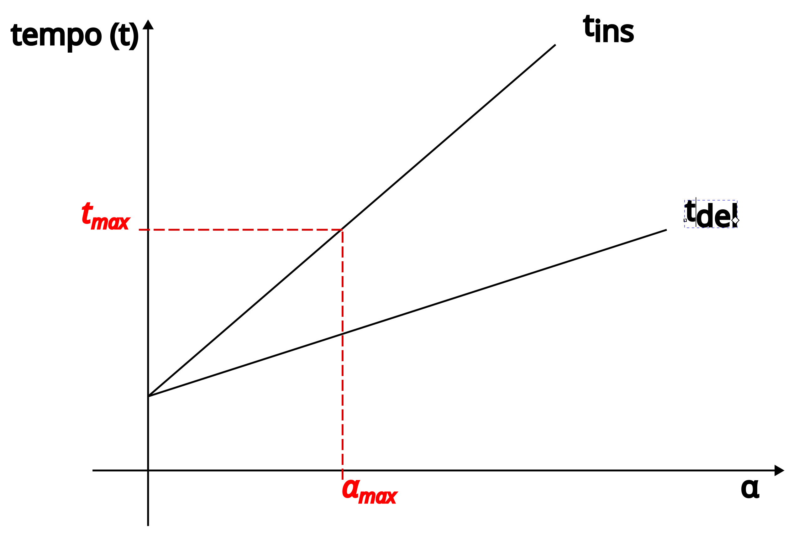

# Resolução de Colisões

## I. Open hashing

- Várias chaves na mesma posição (por ex., em uma lista encadeada)

**Exemplo:**                            

- `h(k) = k mod 10`

```
   +---+
0  |   |
     .
     .
     .
4  |   |
   +---+
5  | ----→ 195 → 1215 → 75 → ⊥ 
   +---+
6  |   |
     .
     .
     .
9  |   |
   +---+
```

### Análise

#### Pior caso: todas as chaves na mesma posição
  ⟹ acesso, ins, del precisa comparar com todas as `n` chaves na coleção 

#### Melhor caso: sem colisões
  ⟹ acesso, ins, del realiza no máximo uma comparação 

#### Caso médio: 

- Hipótese da **dispersão uniforme simples**: A probabilidade de uma chave cair em qualquer posição é a mesma das demais 

$$
\mathbb{P}[h(k) = i] = \frac{1}{m} \quad \forall i, \text{ independente das outras chaves}
$$

- Número esperado de chaves por posição da tabela:
$$
\mathbb{E}[\text{chaves na posição } i] = \frac{n}{m} \quad \forall i, \text{ independente das outras chaves}
$$

- Número de comparações na busca falhada (= inserção): compara com todas as `n/m` chaves da posição

- Número de comparações na busca bem-sucedida (= remoção): na média compara com metade das chaves da posição


#### Definição: Fator de carga

- `α = n/m`, onde
    - `n` = número de elementos na coleção
    - `m` = número de posições da tabela
- O fator de carga dá uma ideia da ocupação média da tabela

⇨ Tempo médio (número de comparações) das operações no hashing aberto



   (*) supondo dispersão uniforme simples

### Rehashing

- Para manter o tempo limitado a um valor máximo $t_{max}$, precisamos limitar o fator de carga a um valor máximo $\alpha_{max}$ (ex. 0,75)
- Quanto maior o $\alpha_{max}$, maior o $t_{max}$, porém menor o espaço usado pela tabela
- Quando o fator de carga $alpha$ atingir o limite $\alpha_{max}$, executa uma redistribuição (**rehashing**):
   - Cria uma nova tabela com o dobro da capacidade atual `m'=2*m`
   - **Re-insere** todos os elementos da tabela na nova tabela, usando o mesmo processo de inserção, porém considerando o novo valor `m'` no cálculo da função de dispersão
   - Ao final, descarta a antiga tabela e continua com a nova tabela. O novo fator de carga será $\alpha' = n/m' = \alpha/2 < \alpha_{max}$

⚠️ Por razões análogas aos da [análise dos arrays dinâmicos](../aula13/aula13.md), o tempo de duplicação das tabelas devido ao rehashing é amortizado ao longo das inserções, acrescentando apenas um fator constante na média por elemento.


___
[[Código-fonte: /src]](./src)   [[< Anterior]](../aula16/aula16.md) [[Próximo >]](../aula18/aula18.md) [[Índice ^]](../index.md)