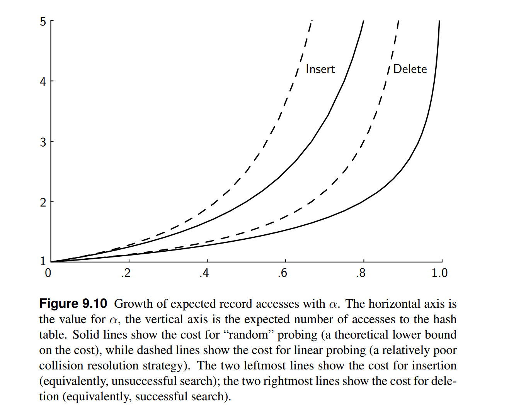

# Resolução de Colisões (Cont.)

## II. Closed Hashing

- Máx. 1 chave por posição  
- Tentar posição inicial  
- Se ocupada, **sondar sistematicamente** outras posições até encontrar vaga

### Função de sondagem

Dados:

- Universo das chaves: $U$  
- Tabela de tamanho `m`  
- `i` = número da sondagem (tentativas)

A função de hashing é definida como:

$$
\begin{aligned}
h : U \times \{0, \dots, m - 1\} &\rightarrow \{0, \dots, m - 1\}\\
(k, i) &\mapsto (h_0(k) + p(k, i)) \bmod m
\end{aligned}
$$

Legenda:
- `h₀(k)` = posição inicial
- `p(k, i)` = função de ``salto'' da tentativa

### Sondagem Linear (Linear Probing)

$$
p(k, i) = i
$$

↪
$$
h(k, i) = [h_0(k) + i] \mod m
$$

#### Exemplo

`m = 10`, `h₀(k) = k mod m`

Chaves: 21, 59, 95, 76, 45, 39

```
     +----+  ↓
   0 | 39 | ← inserido após colisão (39)
     +----+   
   1 | 21 |
     +----+
   2 |    |
     +----+
   3 |    |
     +----+
   4 |    |
     +----+
   5 | 95 | - posição inicial de 45 ocupada
     +----+  ↓                              
   6 | 76 | - sondagem linear para 45 (ainda ocupada)
     +----+  ↓                                
   7 | 45 | ← 45 inserido após sondagem
     +----+   
   8 |    |
     +----+
   9 | 59 | - posição inicial de 39 ocupada
     +----+  ↓                                 
```

⚠️ **Problema** : Primary Clustering - Posições vizinhas a regiões densas têm maior chance de serem escolhidas.

**Exemplo:**

$$
P[h = 8] = P[h_0 \in \{5,6,7,8\}] = \frac{4}{10} > P[h = 3] = \frac{1}{10}
$$

### Alternativas

- **Sondagem quadrática**:  $p(k, i) = ai^2 + bi + c$

- **Sondagem (pseudo-) aleatória**:  $p(k, i) = \Theta[i]$

    onde $\Theta$ é uma permutação aleatória fixa de `{0,...,m-1}`

⚠️ **Problema:** Clustering secundário - Se `h₀` gera cluster, `h` também gera.

### Tempo das operações do closed hashing



- Para garantir um tempo máximo $t_{max}$ por operação, escolhemos um fator de carga máximo $\alpha_{max}$ (ex. 0.5) e realizamos o rehashing como descrito anteriormente


___
[[Código-fonte: /src]](./src)   [[< Anterior]](../aula17/aula17.md) [[Próximo >]](../aula19/aula19.md) [[Índice ^]](../index.md)
