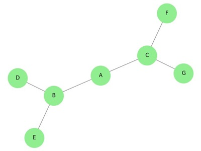
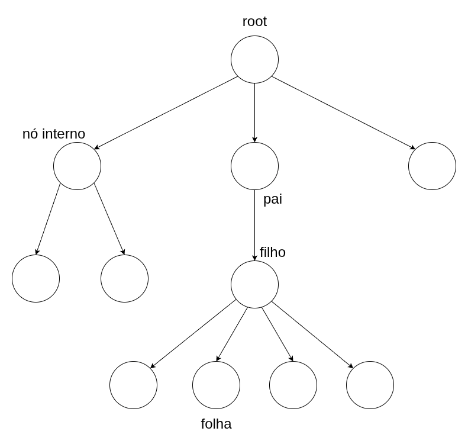

# Árvores

- Matematicamente, uma árvore é um grafo conexo acíclico
    - Grafo: **nós** (vértices) ligados por **arestas** `G=(V,E)`
    - Conexo: existe sempre um caminho entre dois nós quaisquer
    - Acíclico: Não contém ciclos, i.e. caminhos que começam e terminam no mesmo nó

    

⚠️ Esta definição não leva em conta a direção das arestas

Vamos nos concentrar no uso de árvores como estruturas de dados para armazenar informação de forma estruturada nos nós

## Árvores enraizadas

- Numa árvore enraizada as arestas têm uma direção 
```
 .--------.
 | Nó pai |
 `--------'
     |
     |
     v
.----------.
| Nó filho |
`----------'
```

- Um nó pai pode ter 0 ou mais filhos
- Cada nó tem exatamente um nó pai, com exceção de um único nó que não tem pai
- O nó que não tem pai é chamado **raiz** (root)
- Os nós que não têm filhos são chamados **folhas**
- Os demais nós são chamados **nós internos**



- Árvores enraizadas são usadas para representar estruturas hierárquicas, ex. um sistema de arquivos

```
.
├── modules
│   ├── drivers
│   │   ├── amdgpu_drv.so
│   │   ├── ati_drv.so
│   │   ├── fbdev_drv.so
│   │   ├── intel_drv.so
│   │   ├── modesetting_drv.so
│   │   ├── nouveau_drv.so
│   │   ├── qxl_drv.so
│   │   ├── radeon_drv.so
│   │   ├── vesa_drv.so
│   │   └── vmware_drv.so
│   ├── extensions
│   │   └── libglx.so
│   ├── input
│   │   ├── inputtest_drv.so
│   │   ├── libinput_drv.so
│   │   └── wacom_drv.so
│   ├── libexa.so
│   ├── libfbdevhw.so
│   ├── libglamoregl.so
│   ├── libint10.so
│   ├── libshadowfb.so
│   ├── libshadow.so
│   ├── libvgahw.so
│   └── libwfb.so
├── protocol.txt
├── Xorg
└── Xorg.wrap
```

## Árvores binárias

- Um tipo particular de árvore enraizada são as **árvores binárias**
- Numa árvore binária cada nó tem no máximo 2 filhos
- Cada nó implementado como um registro

    ```
    +-------+-------+-------+
    | left  |  val  | right | 
    +--/----+-------+----\--+
      /                   \
     v                     v
    ```
    - `node.val`: valor (informação) associado ao nó
    - `node.left`: ponteiro para o nó filho à esquerda
    - `node.right`: ponteiro para o nó filho à direita 

### Definição recursiva

A definição abaixo ajuda a pensar numa árvore binária como uma estrutura recursiva, conveniente para muitos algoritmos

1. Um conjunto vazio de nós é uma árvore binária (árvore vazia)
2. Se 
    - `N` é um nó
    - `T1` e `T2` são ávores binárias *disjuntas* com raízes `r1` e `r2`
    - `N` não está nem em `T1` nem `T2`
    Então

    ```
     T:        N
             /    \
            /      \
          r1        r2
    T1   /  \      /  \  T2
        /    \    /    \
       /______\  /______\
    ```
    é uma árvore binária


### Exemplo


___
[[Código-fonte: /src]](./src)   [[< Anterior]](../aula19/aula19.md) [[Próximo >]](../aula21/aula21.md) [[Índice ^]](../README.md)