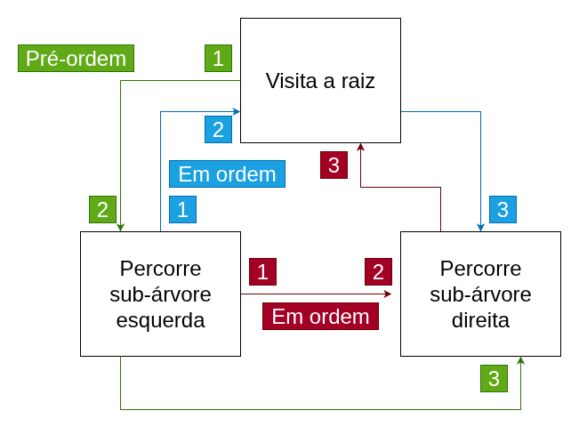
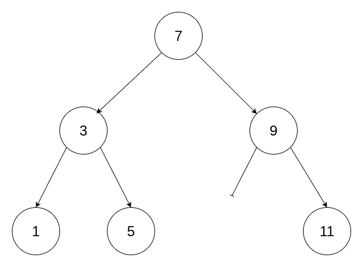

# Percurso em árvores binárias

- Usando a estrutura recursiva da árvore binária, 3 coisas a fazer:
    1. **Visitar** a raiz
    2. **Percorrer** (recursivamente) a subárvore à esquerda
    3. **Percorrer** (recursivamente) a subárvore à direita
- A ordem dessas tarefas determina o tipo do percurso


## Implementação

```cpp
void preorder(Node *root)  
{
    if (root == nullptr) // caso base
        return;             
    visit(root);
    preorder(root->left);
    preorder(root->right);
}
```
- Os demais percursos são similares, mudando apenas a ordem de visita da raiz
- A função `visit` depende da aplicação 
    - exemplo `cout << root->val << "\n"` imprime os nós na ordem desejada

## Exemplo



Pré-ordem: 7, 3, 1, 5, 9, 11
Em ordem: 1, 3, 5, 7, 9, 11
Pós-ordem: 5, 1, 3, 11, 9 , 7


## Aplicações

Vários algoritmos em árvores consistem basicamente num percurso 

### Exemplo (altura)

- A **altura** é o "número de níveis" de uma árvore binária

```
                N ----------------------------------
             /     \                          |           
            /       \                         |    1
--------- r1         r2 -----------          ---
    |     / \        / \        |             |
Hleft    /   \      /   \       |             |    max(Hleft, Hright)
    |   /     \    /     \      Hright        |
------ /_______\  /       \     |             |
                 /_________\ -----------   ------------

```     

```cpp
int height(Node *root) 
{
    if (root == nullptr)
        return 0;        // caso base: arvore vazia tem altura 0
    int Hleft = height(root->left);
    int Hright = height(root->right);
    return 1 + max(Hleft, Hright);
}
```

⚠️ Percurso em **pós-ordem**


___
[[Código-fonte: /src]](./src)   [[< Anterior]](../aula20/aula20.md) [[Próximo >]](../aula22/aula22.md) [[Índice ^]](../README.md)