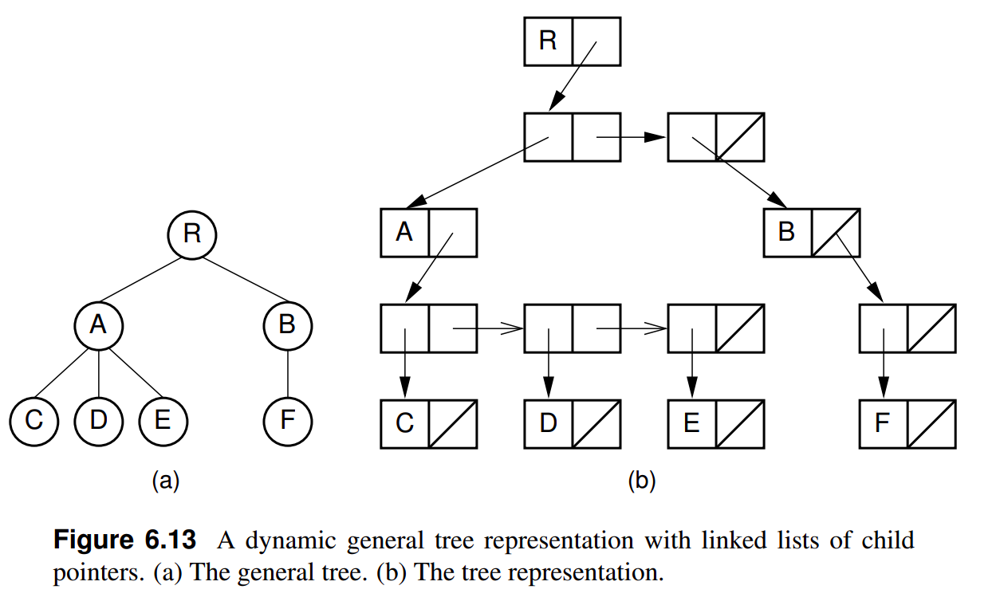

# Implementação de árvores enraizadas de grau arbitrário

- Qualquer quantidade ≥0 de filhos
- A implementação mais direta consiste em armazenar uma lista (ou vector) de ponteiros para filhos

```cpp
template <typename T>
class Node {
    T val;
    vector<Node*> chd;   // filhos
    ...
};
```
(Source: [narytree.cpp](./src/narytree.cpp))

- Prós: acesso rápido a cada filho (com vector)
- Contra: quantidade de memória variável por nó

💡 É possível representar uma árvre n-ária com qtde constante de memória por nó?

## Implementação first-child/next-sibling

Dois ponteiros por nó:
1. Primeiro filho
2. Próximo nó irmão (à direita)




```cpp
template <typename T>
class Node {
private:
    T val;
    Node* firstChd;
    Node* nextSibling;
public:

}
```
(Source: [narytree.cpp](./src/narytree.cpp))


- Prós: quantidade fixa de memória por nó
- Contra: filhos percorridos sequencialmente

```cpp
template <typename T>
Node<T> *Node<T>::Chd(size_t i) {
    int cnt = 0;
    Node<T> *cur = this->firstChd;
    while(cnt < i) {
        cur = cur->nextSibling;
        cnt++;
    }
    return cur;
} 
```

___
[[Código-fonte: /src]](./src)   [[< Anterior]](../aula21/aula21.md) [[Próximo >]](../aula23/aula23.md) [[Índice ^]](../README.md)
