## Conceitos básicos

Os exercícios da disciplina serão realizados através da plataforma GitHub Classroom. 
Nesta plataforma, temos os seguintes conceitos:

### Classroom 

* Corresponde a uma turma, com uma lista de alunos, na qual os exercícios serão publicados.
* E.g. `CIN0135-20252`

    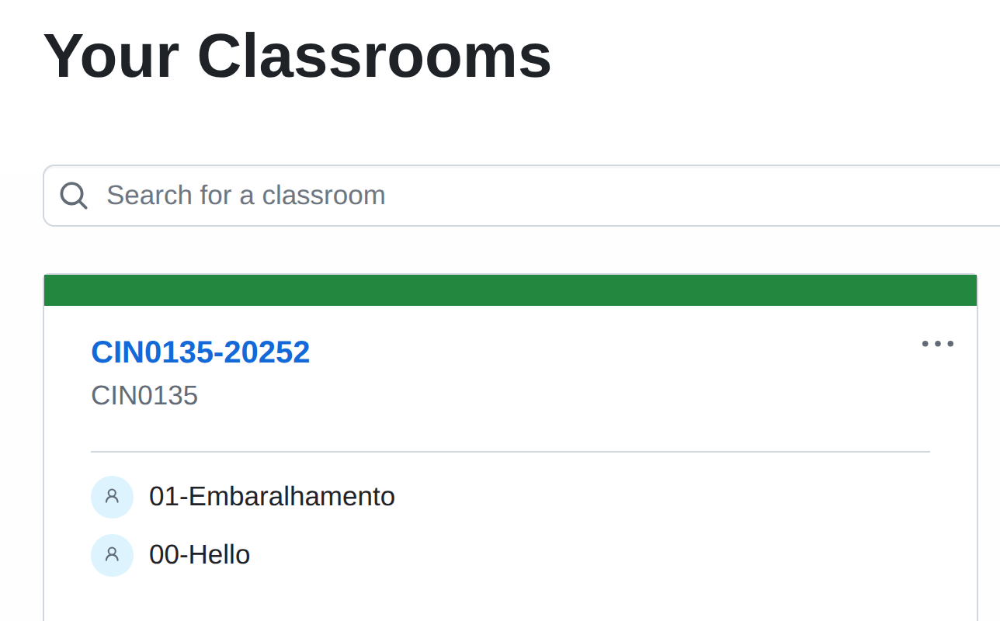

### Assignment

* Um exercício publicado numa turma.
* E.g. `01-Embaralhamento`
* Cada exercício é baseado num repositório modelo (*template*)

    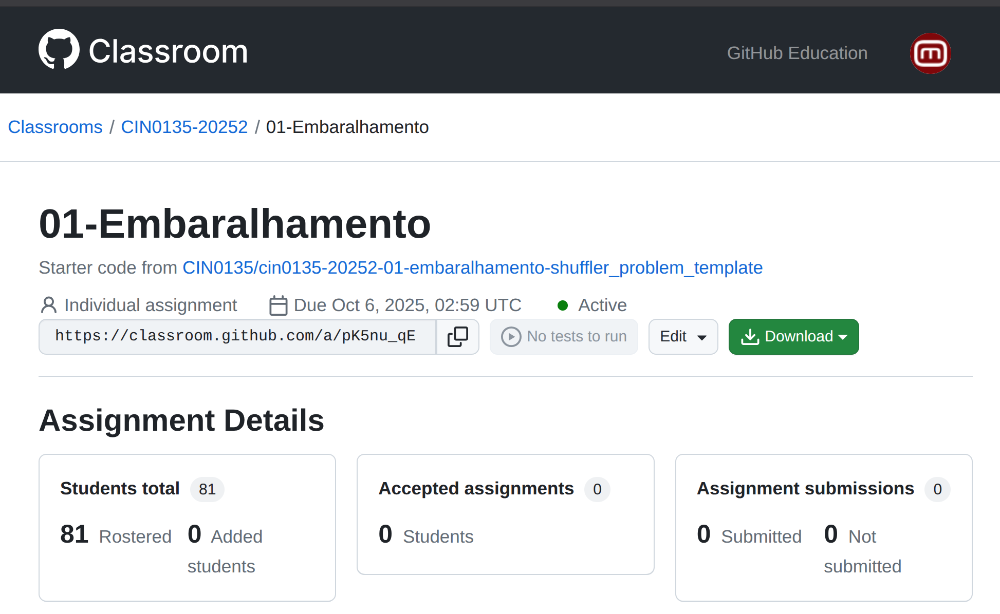

## Aceitando uma tarefa

* Para cada exercício, o professor divulgará um link com um convite para o aluno aceitar e participar na atividade.
* Para acessar o link, o aluno precisa estar logado na sua conta do GitHub. Caso não esteja, será requisitado a fazê-lo.
* Caso seja a primeira vez que o aluno aceita uma atividade da turma, precisará juntar-se à turma vinculando sua conta do GitHub ao seu nome na lista de alunos (*roster*)

    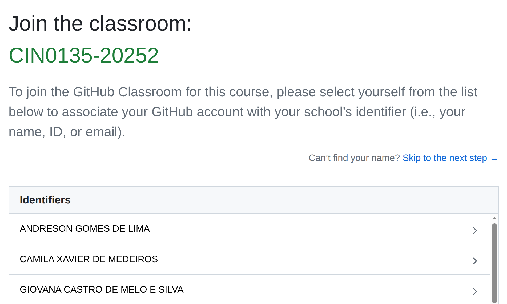
* Uma vez acessado o link, o aluno receberá um prompt para confirmar que aceita o assignment.

    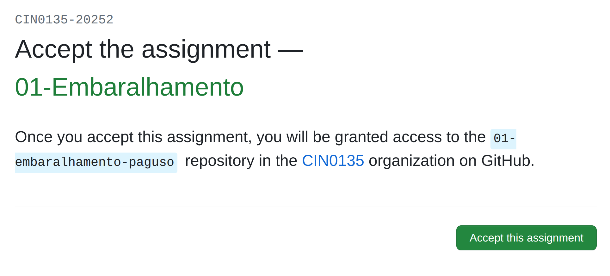
* Uma vez aceito o assignment, será criado um **repositório remoto** (i.e. no servidor do GigHub) consistindo de uma cópia do repositório template da atividade sob proprieadade do GitHub user do aluno (e.g. `https://github.com/CIN0135/01-embaralhamento-paguso`)

    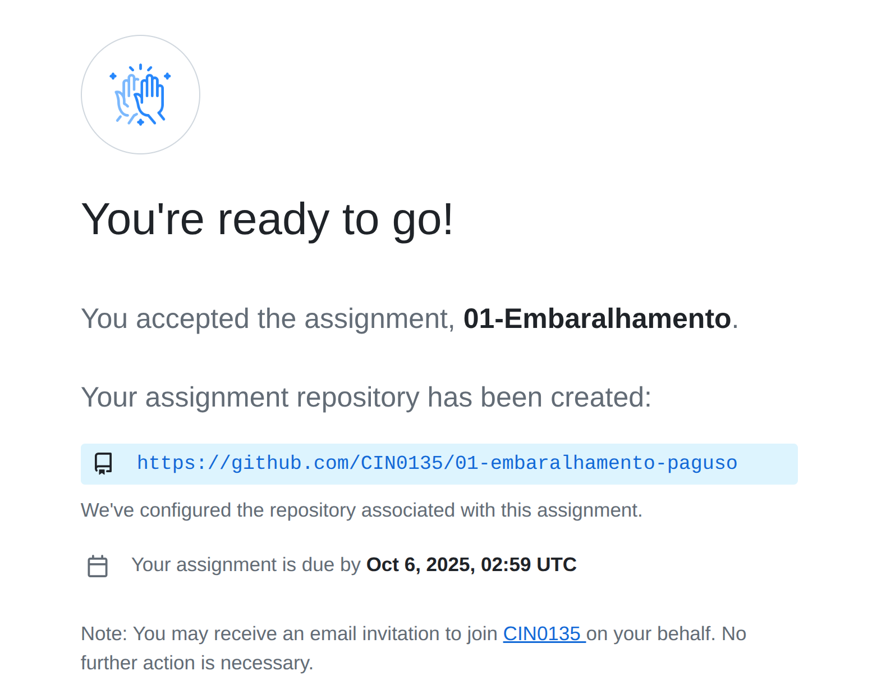

* O aluno deverá realizar o trabalho nesse repositório, que também pode ser acessado pelo professor.

    > ⚠️ **O repositório do aluno deve ser privado! É proibido compartilhar o código com os colegas. Caso seja detectada alguma cópia, todos os participantes envolvidos terão suas atividades zeradas, independente do autor original**

## O repositório da atividade

* Cada atividade corresponde a um problema de programação para o qual o aluno precisará criar ou (mais comumente) completar um esqueleto de código pré-existente.
* Normalmente o código deverá ser receber a entrada pela stream de entrada padrão `std::cin` e deve imprimir o resultado para a saída padrão `std::cout`.
* Essa solução será automaticamente testada e pontuada pelo GitHub Classroom como explicado posteriormente.
* O repositório da atividade de cada aluno tipicamente contém alguns arquivos que devem ser usados ou modificados para resolver o exercício.
    * `README.md`
        - Contém a descrição da atividade
        - Normalmente composto de algumas seções:
            - Descrição
            - Formato de Entrada
            - Formato de Saída 
            - Instruções de implementação
    * `*.in` :  Arquivos com entradas para teste/avaliação do programa
    * `*.out`:  Arquivos com as saídas esperadas para as respectivas entradas e usados para teste/avaliação do programa
    * `Makefile`: usado para automação das tarefas de build e teste da atividade.  
    * `solver.cpp`: arquivo contendo esqueleto de código com o ponto de entrada (função `main`) da solução do problema. **Deve ser completado mas não renomeado**.
    * `sanity.cpp`: programa contendo alguns testes de sanidade da solução. ⚠️ **Não deve ser modificado**
    * `*.hpp`: alguns arquivos de cabeçalho usados pelo programa. Pode ser necessário completar alguns desses arquivos conforme instruções de implementação no `README.md`.

## Clonando o repositório da atividade 

* A maneira sugerida de trabalhar no exercício é **clonar** localmente o repositório remoto e trabalhar na cópia local da sua máquina usando um ambiente como o `VSCode`.
* Para clonar o repositório remoto:
    - Localize o identificador do repositório na caixinha verde `<> Code`
    
    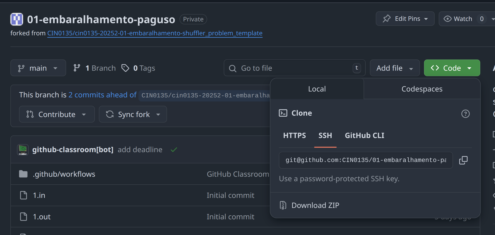

    - São apresentadas algumas opções dependendo do método de acesso remoto ao repositório.  Vamos usar aqui a opção `SSH`
    - Para clonar o repositório via SSH, crie uma diretório adequado no sistema e, neste diretório, utilize o comando `git clone IDENTIFICADOR_DO_REPOSITÓRIO`. 

    > Exemplo: `git clone git@github.com:CIN0135/01-embaralhamento-paguso.git` 

    - Na primeira vez, é provável que o git não reconheça a identidade do servidor GitHub nem encontre a chave criptográfica necessária para  autenticar o acesso 

    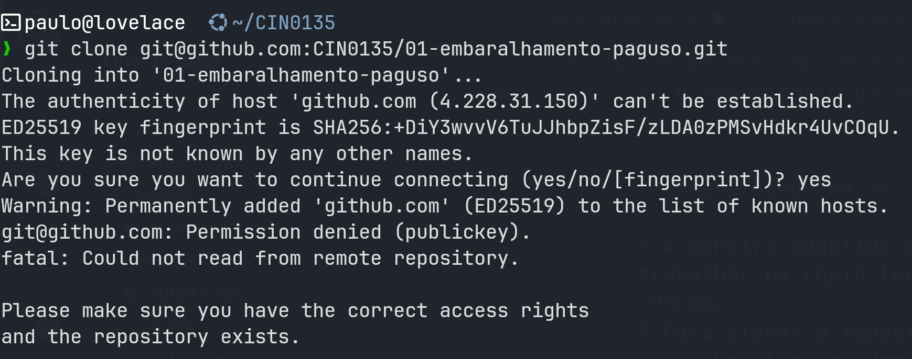

    - Você deve autorizar a conexão

    > `Are you sure you want to continue connecting (yes/no/[fingerprint])? yes`

    mas mesmo assim ainda faltará as chaves de acesso.

* Para gerar um par de chaves criptográficas, utilize o utilitário `ssh-keygen`

    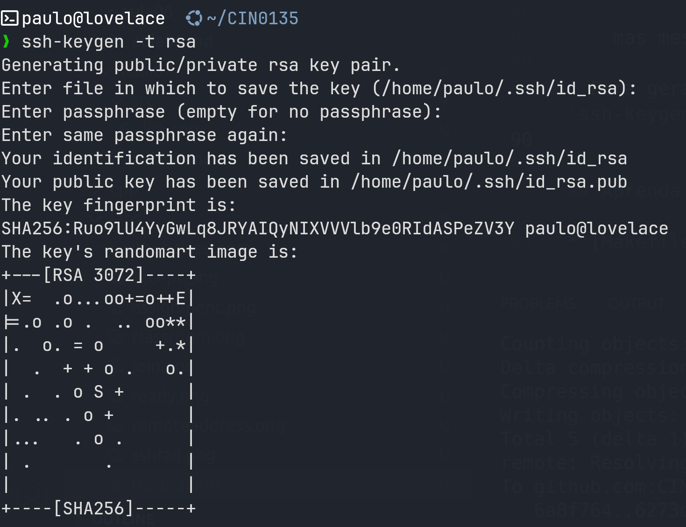

    - Um par de chaves será criada no diretório `~/.ssh`:
        - `id_rsa.pub`: chave pública
        - `id_rsa`: chave privada

* Em seguida você deve adicionar a **chave pública** à lista de chaves autorizadas no GitHub. Na página principal do GitHub: **Settings > SSH and GPG Keys > New SSH key**

    [💻 Tutorial](https://docs.github.com/en/authentication/connecting-to-github-with-ssh/adding-a-new-ssh-key-to-your-github-account)

* Uma vez adicionada a chave, o `git clone` deve funcionar e uma cópia local do repositório deve ser criada.

    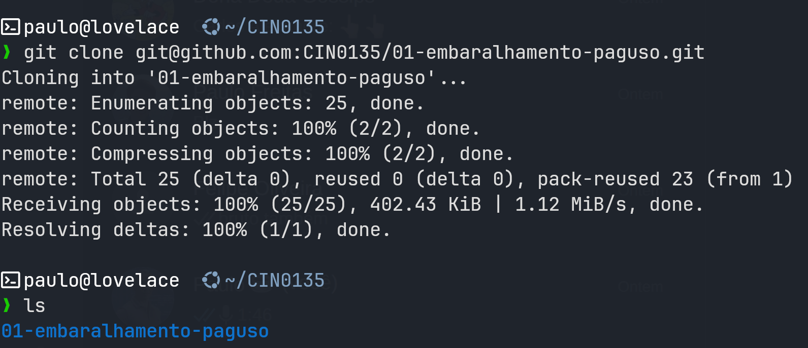

## Trabalhando no repositório local

* Para trabalhar no repositório, sugerimos usar um editor como o VSCode.
* Leia atentamente as instruções do `README.md`
* Normalmente será necessário completar a implementação de um esqueleto de código em arquivos como o `solver.cpp` e outros arquivos de cabeçalho `.hpp`
* Os locais onde o código deve ser adicionado estão sinalizados no código-fonte

    

* Explorar o repositório para entender como os diferentes arquivos se encaixam

## Testando o seu código

* Normalmente o repositório contém arquivos de entrada `1.in, 2.in, ...` e suas respectivas saídas esperadas `1.out, 2.out, ...`
* O programa deve aceitar entrada pela entrada padrão `std::cin` e imprimir as respostas na saída padrão `std::cout`
* Para testar o programa, você pode usar o `Makefile` contido no repositório.
* O `Makefile` contém uma série de testes

    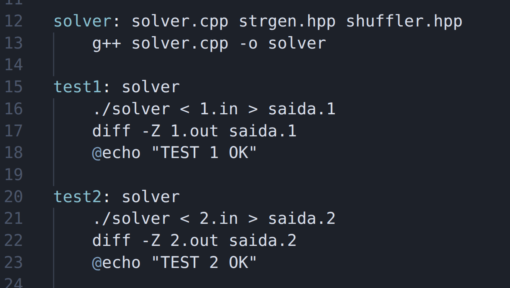

* Para rodar um teste, após modificar o código, você deve usar um comando como 

    > `make test1`

* O teste irá:
    1. recompilar o programa 
    2. executar o programa usando um dos arquivos de entrada redirecionado para a entrada padrão, e redirecionando também a saída para um arquivo (`./solver < 1.in > saida.1`)  
    3. comparar o arquivo de saída produzido no passo anterior com a resposta esperada (`diff -Z 1.out saida.1`)

    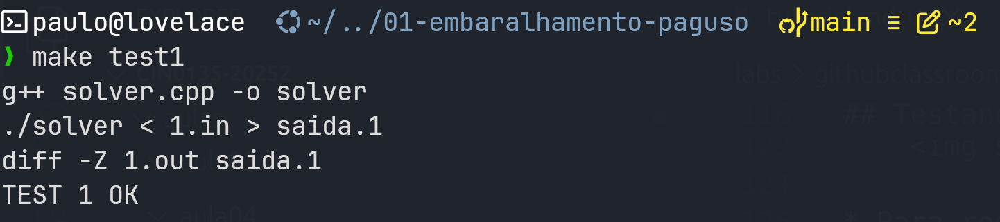

## Submetendo a resposta ao GitHub Classroom

* Uma vez que seu código passe em todos os testes, você deve submetê-lo ao github classroom para pontuação.
* Para isso:
    - `git commit` para efetivar as modificações no repositório local
    - `git push` para subir as modificações e sincronizar o repositório local como o remoto

    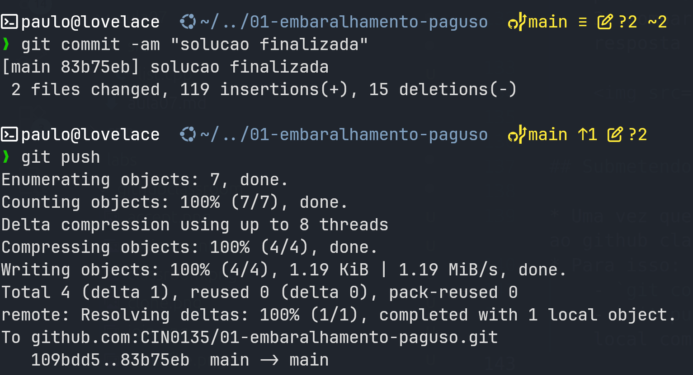

* A cada commit, o GitHub executará uma rotina de testes automáticos consistindo dos mesmos testes contidos no `Makefile`, pontuando cada teste bem-sucedido individualmente.
* Você pode acompanhar o resultado pela página do repositório no GitHub

    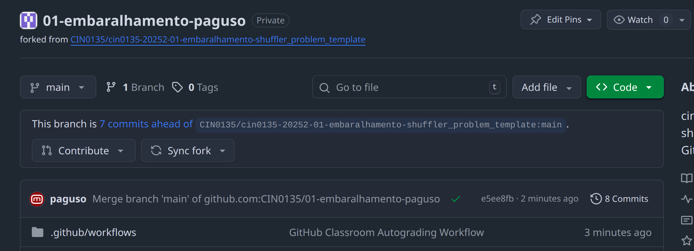
    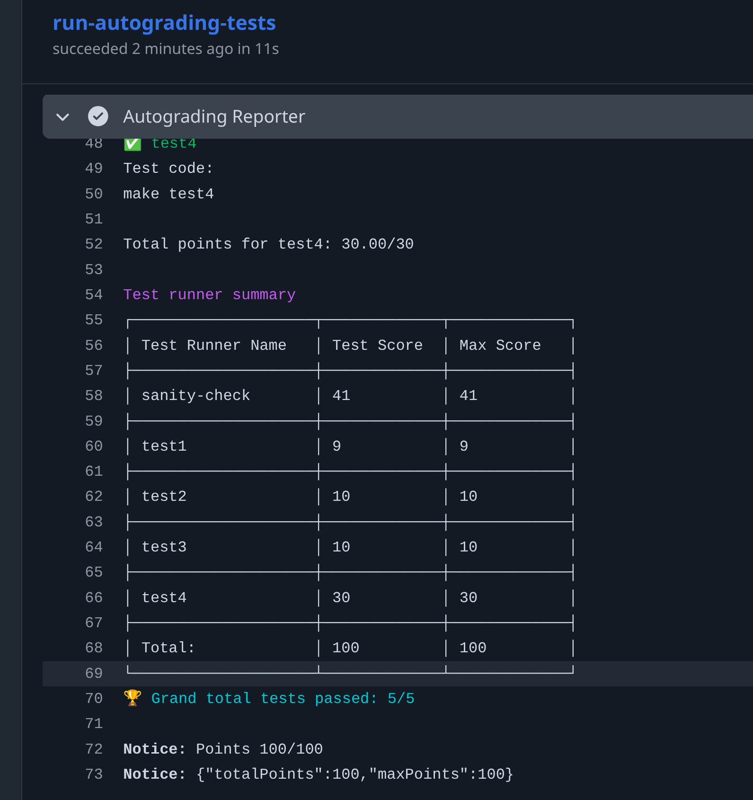

## Aprenda mais

* [Makefiles](https://embarcados.com.br/introducao-ao-makefile/)